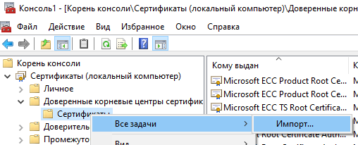

# Flexberry.NginxRouting.Sample

Пример содержит в себе:

- Основная БД, **postgreSQL**;
- База аудита, **clickhouse**;
- Основной бекенд, **odata**;
- Фронтенд, **ember-app**;
- Бекенд для аудита, **AuditBigData**;
- **Nginx**, для https и перенаправления запросов

Когда с фронтенда идет запрос к объектам аудита (http://localhost/odata/NewPlatformFlexberryAuditBigDataAuditRecords), то Nginx должен перенаправить на бекенд аудита, по адресу http://localhost:6505/odata/NewPlatformFlexberryAuditBigDataAuditRecords.

## Генерация сертификатов для тестирования

При генерации сертификатов использовался пароль: *jhvjhvjhvjhv*

1. Устанавливаем [Git for Windows](https://git-scm.com/download/win);
2. Переходим в папку **c:\Program Files\Git\mingw64\bin**;
3. Генерируем сертификат для корневого центра сертификации, который будет называться **rootSSL**;

Генерация ключа:
```cmd
openssl genrsa -des3 -out rootSSL.key 2048
```

Генерация сертификата:
```cmd
openssl req -x509 -new -nodes -key rootSSL.key -sha256 -days 1024 -out rootSSL.pem
```

4. Добавляем сгенерированный сертификат в список доверенных сертификатов;

- Выполняем команду **mmc**;
- Меню **Файл** -> **Добавить или удалить оснастку...** -> **Сертификаты** -> добавить -> учетной записи компьютера -> локальным компьютером;
- Импортируем сертификат в доверенные корневые центры сертификации, указываем сгенерированный **rootSSL.pem** файл.



5. Генерируем сертификат для сайта, который мы будем открывать как **servicebus.local**;

Запрос сертификата к центру сертификации:
```cmd
openssl req -new -sha256 -nodes -out servicebus.local.csr -newkey rsa:2048 -keyout servicebus.local.key -subj "/C=RU/ST=Perm/L=Perm/O=Client One/OU=Dev/CN=servicebus.local/emailAddress=hello@servicebus.local"
```

Получение сертификата:
```cmd
openssl x509 -req -in servicebus.local.csr -CA rootSSL.pem -CAkey rootSSL.key -CAcreateserial -out servicebus.local.crt -days 500 -sha256 -extensions "authorityKeyIdentifier=keyid,issuer\n basicConstraints=CA:FALSE\n keyUsage = digitalSignature, nonRepudiation, keyEncipherment, dataEncipherment\n  subjectAltName=DNS:servicebus.local"
```

После этого файлы **servicebus.local.crt** и **servicebus.local.key** готовы к использованию.

6. Добавляем перенаправление в **hosts**.
```h
127.0.0.1	servicebus.local
```

## Использование сертификатов в Nginx для HTTPS

1. Настраиваем шаблон конфигурации для nginx;

Файл **nginx.conf.template**
```
...

http {
  ...

  server {
    ...

    ssl_certificate       /etc/nginx/certs/servicebus.local.crt;
    ssl_certificate_key   /etc/nginx/certs/servicebus.local.key;

    ...
  }
}
```

2. Копируем файлы настройки и сертификаты в нужные каталоги образа;

Файл **Dockerfile.Nginx**
```docker
FROM nginx:1.21

RUN rm /etc/nginx/conf.d/default.conf

COPY nginx.conf.template /etc/nginx/nginx.conf.template
COPY cert/servicebus.local.crt /etc/nginx/certs/
COPY cert/servicebus.local.key /etc/nginx/certs/
```